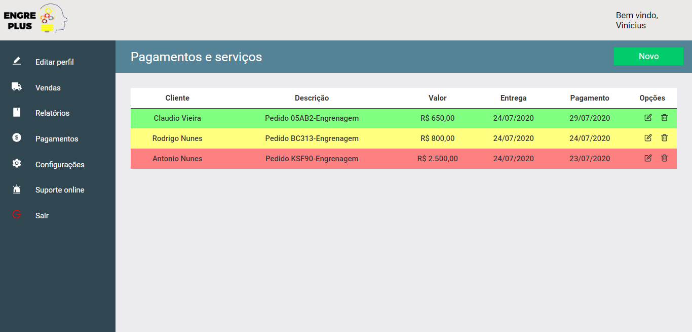
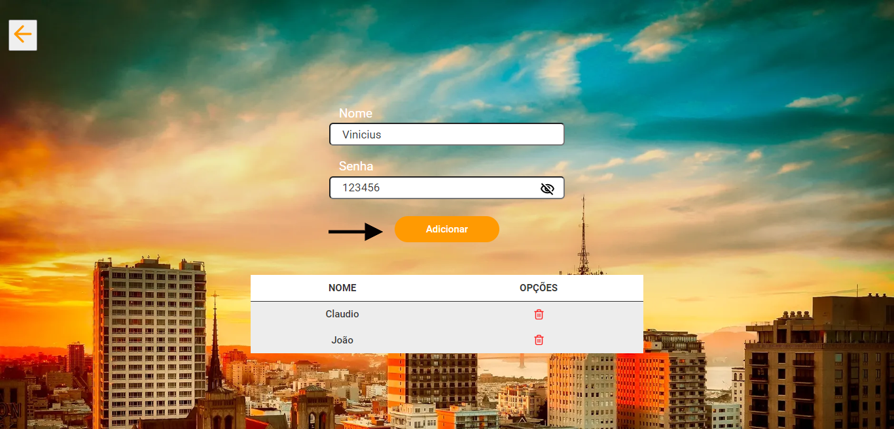

<h3 align="center">
    
</h3>

<h3 align="center">EngrePlus</h3>

<div align="center">
  <a href="https://www.linkedin.com/in/rodrigo-vieira-a42aa8199/">
    
  </a>
    
  <a href="https://github.com/rodrigo5v/engreplus/blob/master/LICENSE">
    
  </a>
</div>

---

### 📺 Apresentação:

A <strong>EngrePlus</strong> é uma aplicação feita para uma [empresa](https://www.facebook.com/pages/category/Industrial-Company/Engreplus-561305084345963/) de criação e conserto de engrenagens. O sistema tem como função aprimorar o controle e gerenciamento de serviços/pagamentos da empresa.
Disponibilizamos parte do código, <strong>no qual não consiste na aplicação e layout final.</strong>

<h3 align="center">
    
</h3>

---

### 💻 Tecnologias utilizadas
- [Node](https://nodejs.org/en/)
- [ReactJS](https://pt-br.reactjs.org/)
- [SQLite3](https://www.sqlite.org/index.html)
- [HTML](https://developer.mozilla.org/pt-BR/docs/Web/HTML)
- [CSS](https://developer.mozilla.org/pt-BR/docs/Web/CSS)

---

 ### 🔥 Instalação e inicialização

 #### Pré-requisitos

 - É <strong>necessário</strong> ter instalado o [Node](https://nodejs.org/en/) qualquer versão <strong>acima de 10</strong>.
- Instalar o [NPM](https://www.npmjs.com/get-npm) ou [YARN](https://classic.yarnpkg.com/pt-BR/docs/install/) (recomendamos o NPM).

##### 1º :page_facing_up: Clone no repositório:

```sh
    $ git clone https://github.com/rodrigo5v/engreplus.git
```

##### 2º :fast_forward: Instale as dependências usando NPM ou YARN e execute a aplicação:

- Iniciando o back-end

```sh
    # Pelo prompt de comando entre na pasta backend
    $ cd code/backend

    # Instale as dependências
    $ npm install

    # Inicie o servidor
    $ npm start
```

- Iniciando a aplicação web

```sh
    # Pelo prompt de comando entre na pasta web
    $ cd code/web

    # Instale as dependências
    $ npm install

    # Inicie a aplicação
    $ npm start

    # Automáticamente será aberta uma janela no seu navegador padrão.
    # Caso isso não ocorra acesse: localhost:3000.
```

---

### 🏡 Sobre a aplicação

Para cadastrar um usuário você precisa entrar na tela de <strong>administrador</strong> da aplicação.

<h3 align="center">
    
</h3>


Em seguida, cadastre um usuário com seu <strong>nome</strong> e <strong>senha</strong>.

<h3 align="center">
    
</h3>


Por fim, volte para a tela inicial e realize o <strong>login</strong> usando os respectivos dados cadastrados.

<h3 align="center">
    
</h3>

---

### :raised_hand: Dependências

#### Backend

- bcrypt
- compression
- cors
- express
- helmet
- jsonwebtoken
- knex
- sqlite3
- nodemon

#### Web

- axios
- jsonwebtoken
- react
- react-dom
- react-icons
- react-input-mask
- react-router-dom
- react-scripts

---

### 🔒 Licença

Esse projeto está sob a licença MIT. Veja o arquivo [LICENSE](LICENSE) para mais detalhes.

---

Feito com ❤️ by [Rodrigo Vieira](https://www.linkedin.com/in/rodrigo-vieira-a42aa8199/).